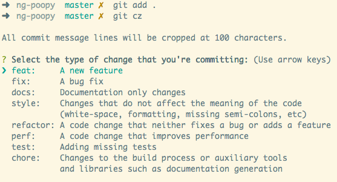

# Git Commit Message and Changelog

It's about the commit message conventions and tooling for generating changelogs.

This's mostly inspired by the Angular community's
[Git Commit Message Conventions](https://docs.google.com/document/d/1QrDFcIiPjSLDn3EL15IJygNPiHORgU1_OOAqWjiDU5Y/edit?usp=sharing) with minor modifications.

It could be used as your personal rule,
or promote to the whole project members if everyone agrees.

## Commit Message Conventions

Each commit message consists of a **header**, a **body** and a **footer**.
The header has a special format that includes a **type**, a **scope** and a **subject**:

```txt
<type>(<scope>): <subject>
<BLANK LINE>
<body>
<BLANK LINE>
<footer>
```

The **header** is mandatory and the **scope** of the header is optional.

Any line of the commit message cannot be longer 100 characters!
This allows the message to be easier to read on GitHub as well as in various git tools.

The footer should contain a [closing reference to an issue](https://help.github.com/articles/closing-issues-via-commit-messages/) if any.

Samples: (even more [samples](https://github.com/angular/angular/commits/master))

```txt
docs(changelog): update changelog to beta.5
```

```txt
fix(release): need to depend on latest rxjs and zone.js

The version in our package.json gets copied to the one we publish, and users need the latest of these.
```

```txt
feat(compiler): ability to mark an InvokeFunctionExpr as pure

Uglify and other tree-shakers attempt to determine if the invocation
of a function is side-effectful, and remove it if so (and the result
is unused). A /*@__PURE__*/ annotation on the call site can be used
to hint to the optimizer that the invocation has no side effects and
is safe to tree-shake away.

This commit adds a 'pure' flag to the output AST function call node,
which can be used to signal to downstream emitters that a pure
annotation should be added. It also modifies ngtsc's emitter to
emit an Uglify pure annotation when this flag is set.

Testing strategy: this will be tested via its consumers, by asserting
that pure functions are translated with the correct comment.

close #26860
```

### Revert commit

If the commit reverts a previous commit, it should begin with `revert: `,
followed by the header of the reverted commit.

In the body it should say: `This reverts commit <hash>.`,
where the hash is the SHA of the commit being reverted.

```txt
revert: fix(router): do not finish bootstrap until all the routes

This reverts commit 541de26. Because it introduced a regression.

close #1
```

### Message header

#### Type header

This describes the kind of change that this commit is providing.

- build: Changes that affect the build system or external dependencies (example scopes: gulp, broccoli, npm)
- ci: Changes to our CI configuration files and scripts (example - scopes: Travis, Circle, BrowserStack, SauceLabs)
- docs: Documentation only changes
- feat: A new feature
- fix: A bug fix
- perf: A code change that improves performance
- refactor: A code change that neither fixes a bug nor adds a feature
- style: Changes that do not affect the meaning of the code (white-space, formatting, missing semi-colons, etc)
- test: Adding missing tests or correcting existing tests

#### Scope header

*This value is optional.*

Scope can be anything specifying place of the commit change,
as perceived by the person reading the changelog generated from commit messages.

In Angular, available scopes are npm package names like:

- animations
- common
- router
- etc.

#### Subject header

This is a very short description of the change.

- use the imperative, present tense: "change" not "changed" nor "changes"
- don't capitalize first letter
- no dot (.) at the end

### Message body

- just as in `subject` use imperative, present tense: "change" not "changed" nor "changes"
- includes motivation for the change and contrasts with previous behavior

### Message footer

#### Breaking changes

The footer should contain any information about **Breaking Changes** and is also the place to
reference GitHub issues that this commit **Closes**.

**Breaking Changes** should start with the word `BREAKING CHANGE:` with a space or two newlines. The rest of the commit message is then used for this.

```txt
refactor(core): change abstract classes for interfaces

BREAKING CHANGE: Because all lifecycle hooks are now interfaces
the code that uses 'extends' keyword will no longer compile.

To migrate the code follow the example below:

Before:
```
@component()
class SomeComponent extends OnInit {}
```
After:
```
@component()
class SomeComponent implements OnInit {}
```

we don't expect anyone to be affected by this change.

close #10083
```

#### Referencing issues

Closed bugs should be listed on a separate line in the footer prefixed with "close" keyword like this:

```txt
close #1, close #2, close #3
```

### Tooling

We'll use a tool named [`Commitizen`](http://commitizen.github.io/cz-cli/),
together with some helper libs.

When you commit with Commitizen,
you'll be prompted to fill out any required commit fields at commit time.

#### Installation

I'd like to install the tools locally instead of globally.
If you install them globally, it would be easier to use the tools.

```sh
# run in cli
npm install commitizen --save-dev
```

#### Setup

```sh
# run in cli
npx commitizen init cz-conventional-changelog --save-dev --save-exact
```

It'll auto install a package named "cz-conventional-changelog".
And save some settings in your `package.json`:

```json
{
  "config": {
    "commitizen": {
      "path": "cz-conventional-changelog"
    }
  }
}
```

#### Usage

> Note: we don't use the standard `git commit` command.

Now, it's working.
We could use the command `npx git-cz` to do a normal commit.



You could define your own alias in `package.json`.

```json
{
  "scripts": {
    "commit": "npm run ci",
    "ci": "npx git-cz"
  }
}
```

#### Commit Lint

We may use a tool named [commitlint](https://github.com/marionebl/commitlint)
for linting commit message.

We could set it up in CI system.

## Changelog

Generate changelog from git commit messages.

### Installation

```sh
npm install conventional-changelog-cli --save-dev
```

### Usage

```sh
# https://github.com/conventional-changelog/conventional-changelog/tree/master/packages/conventional-changelog-cli
npx conventional-changelog -p commit-msg-2-changelog -i CHANGELOG.md -s
```

### Recommended workflow
- Make changes
- Commit those changes
- Make sure Travis turns green
- Bump version in package.json
- conventionalChangelog
- Commit package.json and CHANGELOG.md files
- Tag
- Push
